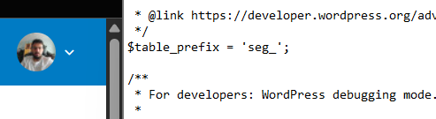
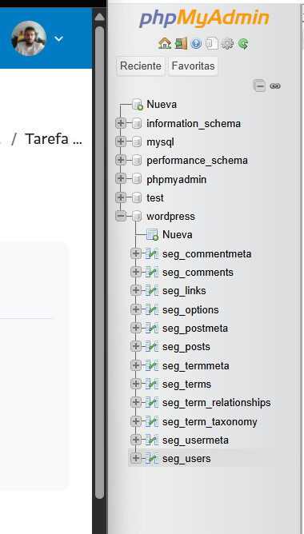
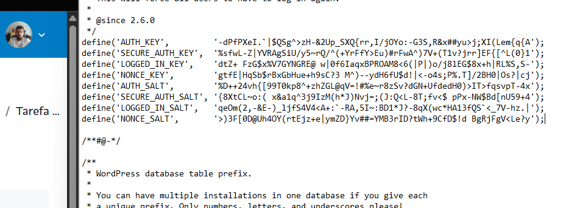
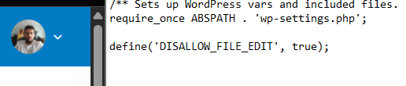
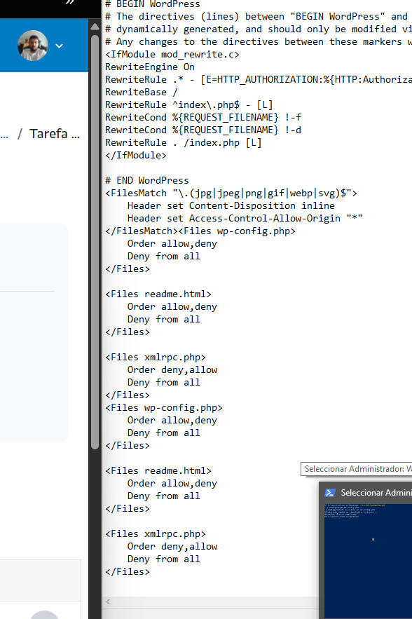
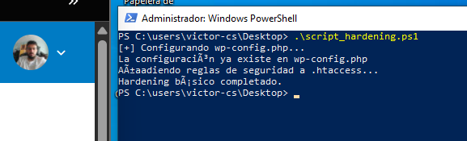

# WordPress Hardening - Tarea 6.2
## Medidas de seguridad aplicadas:
### 1.- Cambio del prefijo de tablas de la base de datos
- Se cambió el prefijo por defecto `wp_` por `seg_`
- Se actualizó el archivo `wp-config.php`:
- Se modificaron los nombres de las tablas en phpMyAdmin y se actualizaron las referencias en la base de datos.



### 2. Claves de seguridad personalizadas en wp-config.php

Se generaron nuevas claves en https://api.wordpress.org/secret-key/1.1/salt/ y se reemplazaron las existentes en el archivo wp-config.php.

### 3. Eliminación del usuario "admin"

Se creó un nuevo usuario administrador con un nombre no predecible.

Se eliminaron los usuarios con nombres comunes como admin o administrator.

### 4. Desactivación de la edición de archivos desde el panel

Se añadió la siguiente línea al archivo wp-config.php:

```define('DISALLOW_FILE_EDIT', true);```

### 5. Protección de archivos sensibles desde .htaccess

En el archivo .htaccess, se añadieron reglas para denegar el acceso a archivos sensibles:
```
<Files wp-config.php>
    Order allow,deny
    Deny from all
</Files>

<Files readme.html>
    Order allow,deny
    Deny from all
</Files>
```

### 6. Desactivación del archivo xmlrpc.php

Se bloqueó el acceso a xmlrpc.php desde .htaccess:
```
<Files xmlrpc.php>
    Order deny,allow
    Deny from all
</Files>
```


### Comprobación ejecución script
